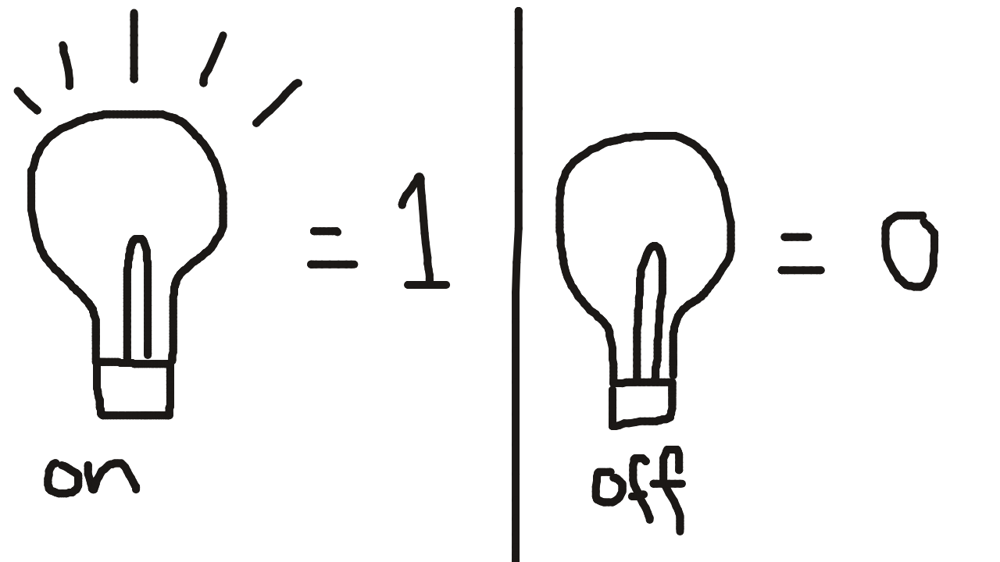
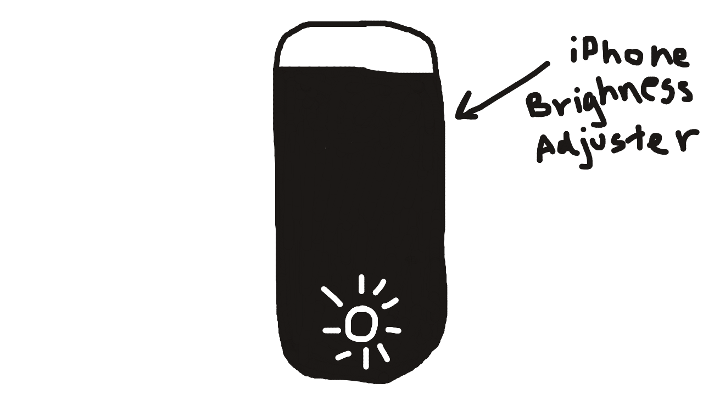

# How Net Works
hidden: true

cover:
excerpt:
tags:
prerequisites:

## Introduction

I never understood network programming. I understood the basic concepts, like packets and stuff, but never the nitty gritty deep dive, how it actually works kinda thing. What ACTUALLY are packets in real life, and what is actually going on?? That's what we'll be talking about in this article.

## The Ethernet

In order to understand how the internet works, we must first understand how it's predecessor worked: The ethernet. It's pretty the same conceptually, except ethernet uses wires and internet just adds more concepts because wires are annoying. 

So let's first talk about wires. What is the point of wires? It's to send data, in the form of bits - 1s and 0s. Imagine like a lightbulb turning on and off. 

If you and your friend lived across the street, and you didn't have a phone or any form of communication, a way you COULD communicate if you guys were bored is using this method—turning your room lights on and off to send a stream of bits, a stream of 0 and 1 signals.

Ok now that you know the purpose of wires, there's a few more things you have to know:

First thing you have to realize is that a 0 bit does NOT equal 0 voltage. Imagine the same lightbulb scenario, but instead of turning the light completely **off** to signal a "0", you just turn the brightness of the light _**down**_. Or, if it's easier, imagine you stop using your room lights because your parents got mad, and instead you starting using your phone's screen brightness (you put your phone's screen on the window and play with the brightness).

