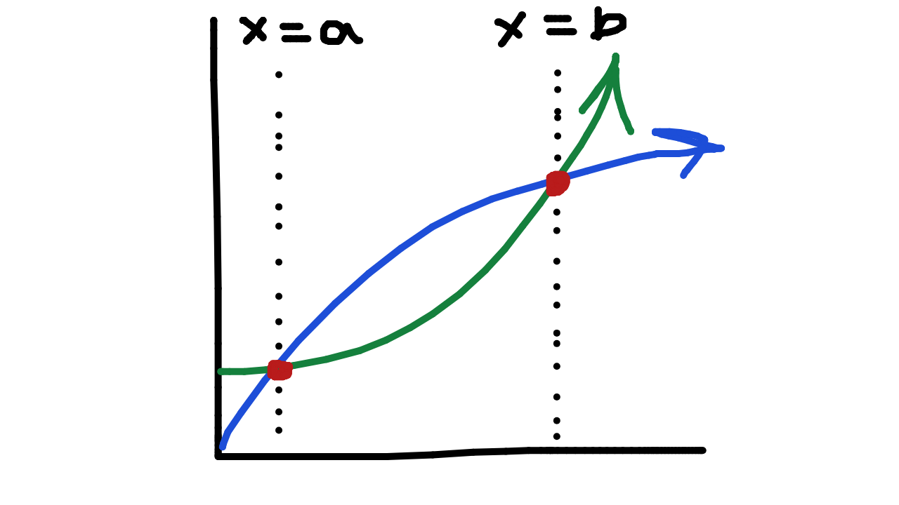
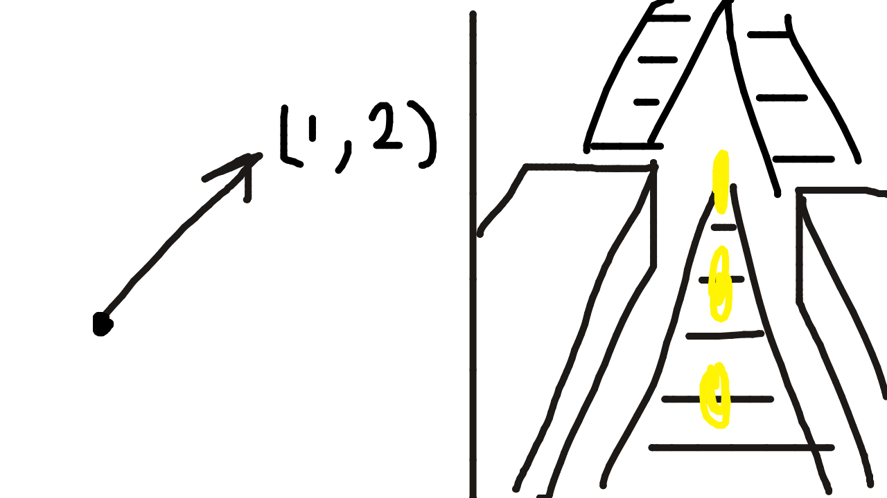

# Linear Algebra, but not f*cking boring

cover:
excerpt:
tags: course, BNFB series
prerequisites:

## Why give af?

it's like useful for machine learning and stuff and also kinda tuff if you really think about it

## wat actually r equations
ok so equations are just like if statements. if you've never done coding before this is what it looks like its super ez: 

```python
if anything happens to mahoraga:
    adapt 🗿
```
u get it? if something happens, do somethign else that's the whole thing. in this case if absolutely anyhting happens to big raga he just adapts thats the condition and action yfm? 

So that's kinda what an equation is, but only the part after the "if". so like in this equation: 

$$
x + y = 10
$$

if we set x to 5 and y to 5, 10 = 10 and thus that equation **BECOMES TRUE**. If we set x to 9000 and y to 2, that equation **BECOMES FALSE**. 

So think about it like in that perspective right like an equation is either true or false like that.

## what is systems of equations
So like systems of equations is like this liek ur getting multiple equations and trying to find points where they're BOTH true that's why when u learn ts in like middle school ur tryna find this:



it's cuz those red dots means the two graphs r AT the same point at those x's-like when x is a or b. 

That's what systems of equations r ur just tryna find where multiple equations are true at the same x like if u have 10 equations or something ur trying to find where all 10 of those equations are TRUE.

## Vectors
ok vectors is the goofiest concept i've ever seen in my life

ok so vectors are TWO THINGS AT THE SAME TIME

you can either think of vectors as like a list of numbers like this: 

[1, 2] and like [[1, 2],[3, 4]] that one is a list of lists

OR you can think of vectors as like arrows like



that's subway surfers on the right side btw

anyhow so here's what happened:

some smart physics guys like 3 billion years ago (number made up for dramatic effect) was like ok how do we move a rock like how do we represent that as like a number or something and they thought well we finna use arrows cuz that's ez. So like im gonna move my rock 2 meters to the right and then 5 meters up and that becomes an arrow from where im at in the beginning to 5 meters above and 2 meters right of it

That's how arrows were born or something like that

and then like way later some guys were like trying to do systems of equations and realized theres patterns on the columns of the numbers and u dont actually need to like do a bunhc of stuff manually

so like look at this:


$$
x + y + z = 1
$$

$$
2x + 3y + 2z = 2
$$

You see how like I don't have to do a bunch of crazy stuff there's clearly probably a pattern like if I multiply the top one by 2 and then minus the bottom one from the top one then I'll get y i don't have to like solve for each thing like this:

$$
x = 1 - y - z
$$

and all of that bullcrap that takes way too long we dont gotta do taht

so that's why u learned this in that way in high school or middle school or wherever i forgot

so then people looked at both of those ways like the arrow and the systems of equations and said 

