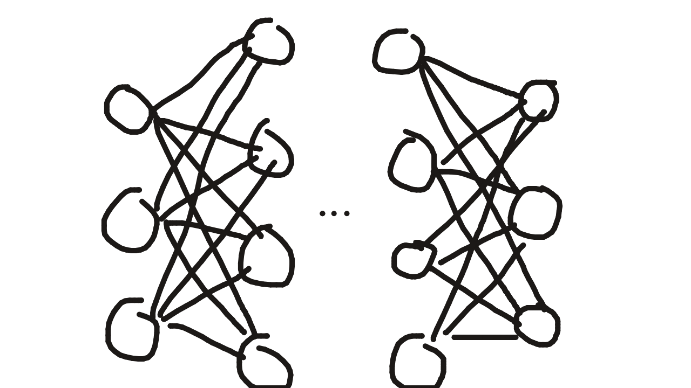
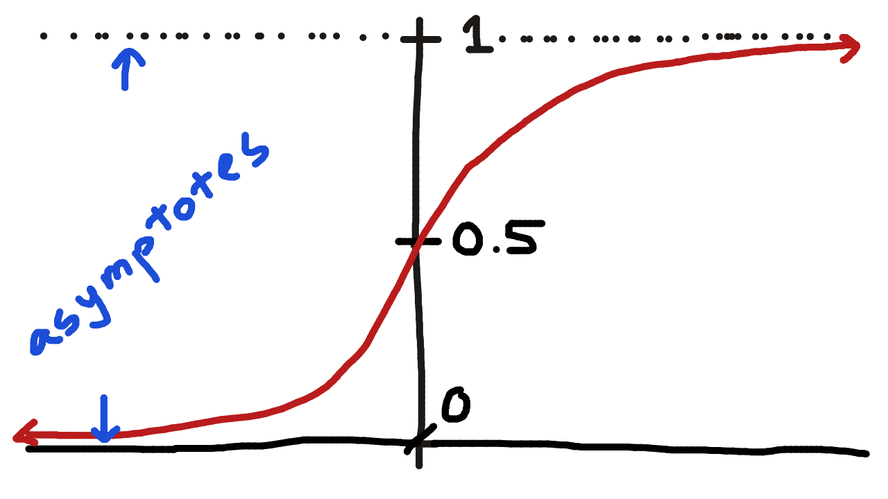

# Machine Learning for the Blind

cover:
excerpt:
tags: Machine Learning, Beginner
prerequisites:

## Introduction

I never understood machine learning. They show all of these diagrams of neural networks and I always took that at surface value. So I am going to do a deep dive and actually start understanding these things. 

## Wait, it's all floats?

Yup, it's all floats. This diagram you see:



Is a LIE. All the circles are just straight up actual numbers, and the lines are also numbers.

What does this mean? Exactly what it means. 

literally

```txt
float neuron = 0.5;
```

That's what those circles are. The same with the lines. They're literally randomly selected floating point numbers with a tiny little bit of added complexity.

That's what gets you chat gpt and claude. Crazy stuff.

Anyhow, let's "build" a "project". Let's say we wanna have a model that detects whether or not some image is that of a cat. we have multiple inputs / neurons. So instead of making more variables by hand, let's use an array: 

```txt
float input[3] = {0.9, 0.3, 0.7}
// very pointy ears, smallish animal, fluff
```

That's it. The comments is what the inputs represent. Now we have 3 inputs. 

By the way, the difference between a neuron and an input is that inputs are the starting point (no one computed the floating point numbers you just determined that it's 0.7 fluffy and 0.9 pointy eared). 

Now let's make some weights. A weight is just a number that indicates how relevant each input is. 

```txt
float weight[3] = {0.8, 0.1, 1.0}

// pointy ears are important (weight[0])
// whether it's a small animal or not isn't (weight[1])
// and fluff is (OBVIOUSLY) very very important (weight[2])
```


So let's use this model now. The closer the result is to 1, the more confident the model is that what we're talking about is a cat. 

```txt
Result = (0.9 * 0.8) + (0.3 * 0.1) + (0.7 * 1.0) = 1.45
```

It doesn't have to be between 0 and 1 btw these are random values I made up and the result happens to be 1.45. But since this is hard to interpret (145% a cat???) we use something called a sigmoid function to squish the value to a percentage point (between 0 and 1). 

This is how the sigmoid works: 

```txt
// Big positive number -> close to 1
// Big negative number -> close to 0
// zero -> 0.5

float sigmoid(float x) {
    return 1.0 / (1.0 + exp(-x));
}
```
oh heyul nah that looks scary

let me put it into math format:

$$
\sigma(x) = \frac{1}{1+e^{-x}}
$$

(the lil symbol thing is sigma 🗿)

this function, when graphed, looks like this: 



Which means whatever x you input, it'll be between 0 and 1. Higher the x, closer f(x) is to 1. Lower the x into negative, the closer f(x) is to 0. 

Anyway now if we put the number we got (1.45) into the sigmoid function we get:


$$
\sigma(1.45) = \frac{1}{1 + e^{-1.45}}
$$

$$
\sigma(1.45)= \frac{1}{1+2.72^{-1.45}}
$$

$$
\sigma(1.45)= \frac{1}{1.23}
$$

$$
\sigma(1.45)= 0.81
$$

The numbers were rounded but you get the point. Kids' stuff. 

Now our model, based on 

```txt
float input[3] = {0.9, 0.3, 0.7}
```
this and 

```txt
float weight[3] = {0.8, 0.1, 1.0}
```
this, thinks that there's an 81% chance that we were in fact describing a cat.

Here's the code you can play with for your very first, bare bones, fully manual neural network model: 


```py
import math

inputs = [0.9, 0.3, 0.7]
# pointy ears, size of animal, fluff

weights = [0.8, 0.1, 1.0]
# pointy ears is important, size not so much, fluff very much so

result = 0.0
# init result var

for i in range(len(inputs)):
    result += inputs[i] * weights[i]
    # add (0.9 * 0.8) + (0.3 * 0.1) + (0.7 * 1.0) to results

sigma = (1/(1 + math.e ** (-1 * result)))
# sigmafy results to become percentage

print(sigma)
# print sigmafied result

```
