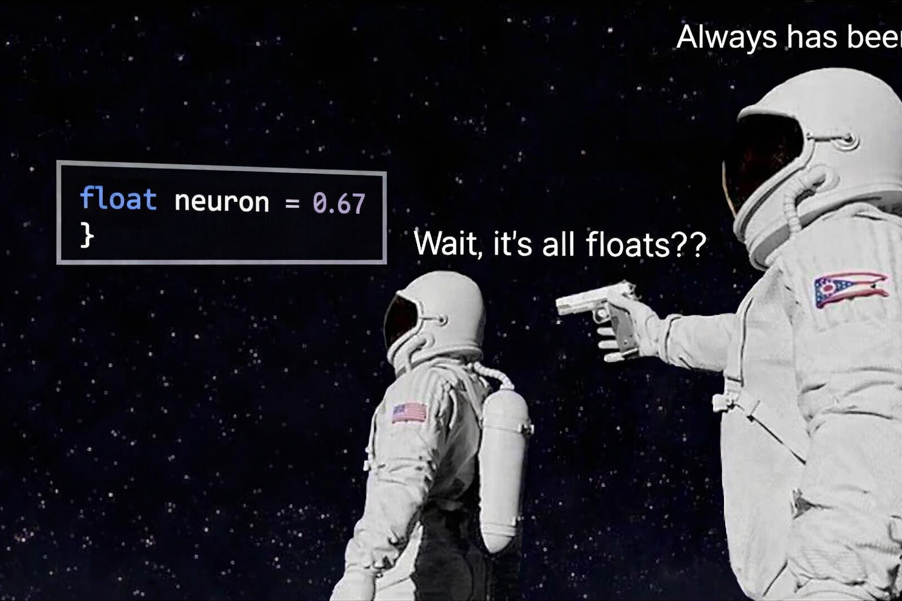
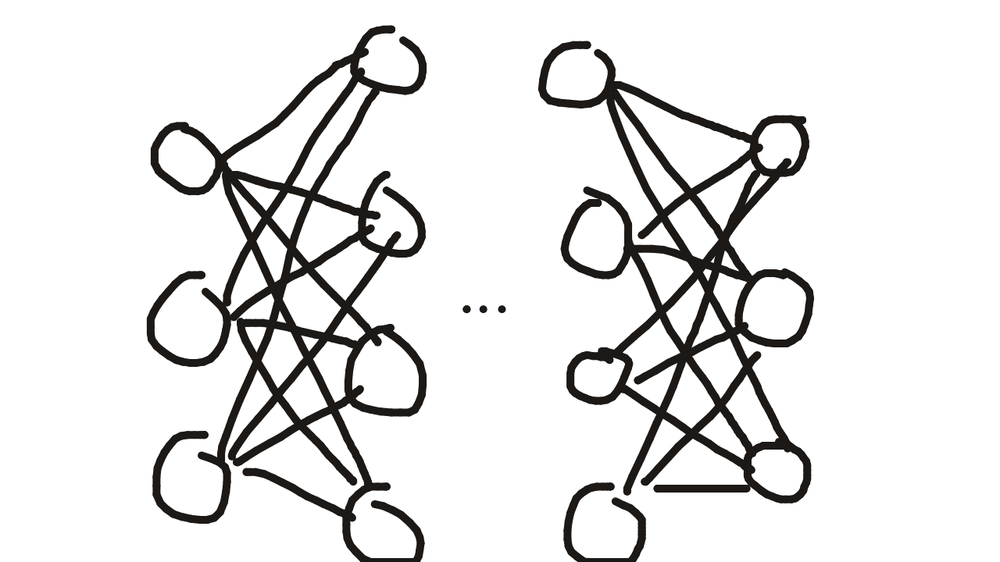
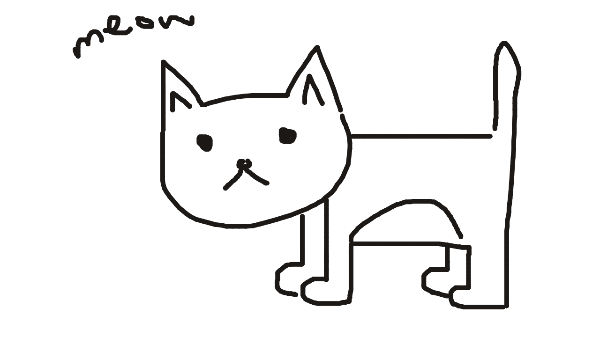
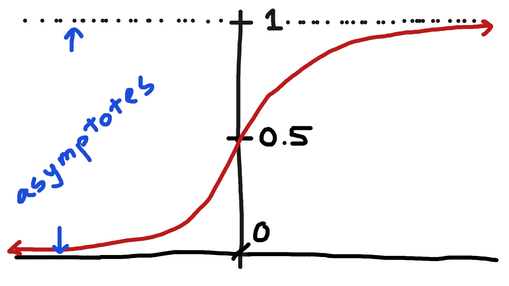
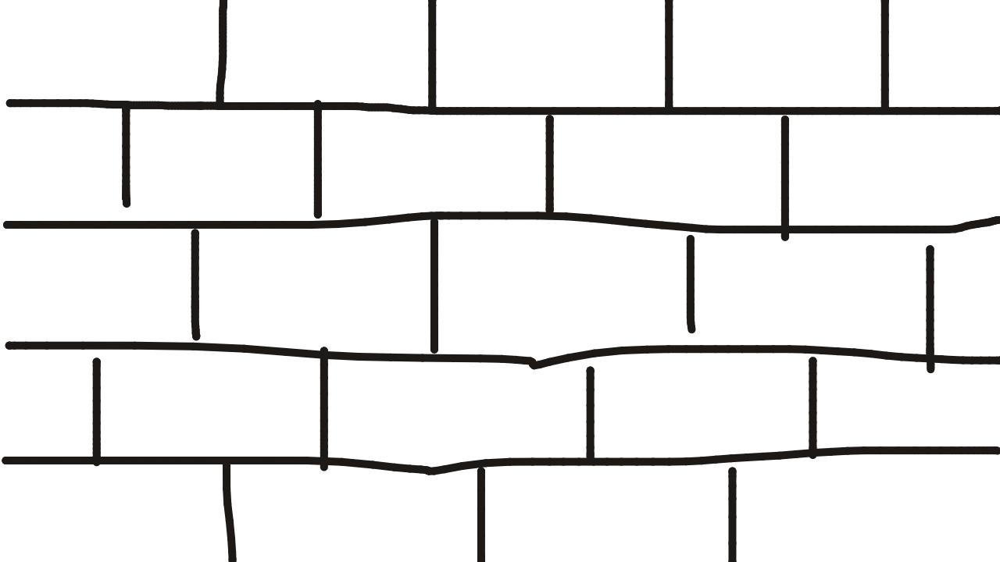

# Machine Learning for the Blind

cover:

excerpt: For those who know the neural network graph thing but don't ACTUALLY know what any of it means
tags: Machine Learning, Beginner
prerequisites:

## Introduction

I never understood machine learning. They show all of these diagrams of neural networks and I always took that at surface value. So I am going to do a deep dive and actually start understanding these things. 

## Wait, it's all floats?

Yup, it's all floats. This diagram you see:



Is a LIE. All the circles are just straight up actual numbers, and the lines are also numbers.

What does this mean? Exactly what it means. 

literally

```txt
float neuron = 0.5;
```

That's what those circles are. The same with the lines. They're literally randomly selected floating point numbers with a tiny little bit of added complexity.

That's what gets you chat gpt and claude. Crazy stuff.

Anyhow, let's "build" a "project". Let's say we wanna have a model that detects whether or not some image is that of a cat. we have multiple inputs. So instead of making more variables by hand, let's use an array: 

```txt
float inputs[3] = {0.9, 0.3, 0.7}
// very pointy ears, smallish animal, fluff
```

That's it. The comments is what the inputs represent. On a scale from 0.0 to 1.0, how pointy are the ears? Take a look at this: 



Those are very pointy ears. In fact, I would say that they're about 9/10. But since we're talking about 0.0 to 1.0, I'll say 0.9/1.0. I'm assuming it's pretty small (0.3/1.0) and just cuz I drew it and i'm biased, it's 0.7/1.0 fluffy. idk how to draw fluff

Anyhow, now we have 3 inputs. 

I'll explain the difference between inputs and neurons a little further down—don't worry about the difference just yet.

Now let's make some weights. A weight is just a number that indicates how relevant each input is. 

```txt
float weight[3] = {0.8, 0.1, 1.0}

// pointy ears are important (weight[0] = 0.8)
// there are big cats and small cats so this doesn't matter that much (weight[1] = 0.1)
// and fluff is (OBVIOUSLY) very very important (weight[2] = 1.0)
```

Ok. So what exactly did we just make?? Well, *technically* we didn't actually make neurons.

```txt
float inputs[3] = {0.9, 0.3, 0.7}
```

These three aren't *neurons*, they're *inputs*. It's just cuz we put the numbers (0.9, 0.3, 0.7) in there ourselves. It was never *computed* by anything else we just thought the ears were pointy and the cat, fluffy.

In order to *actually* create our first **neuron** we have to do some computations. Remember the weights? 

```txt
float weight[3] = {0.8, 0.1, 1.0}
```

We can use the inputs with the weights and make some calculation that means something: 

If the cat's ears are this (0.9) pointy, and pointiness matters this (0.8) much, doesn't it kinda make sense if we just multiply these two numbers?

And then we can do this for all the inputs and their corresponding weights. The cat is this (0.3) big, and size (of the cat) only matters this (0.1) much. The cat is this (0.7) fluffy, and fluffiness matters this(1.0) much. 

Now we can add all the multiplied values together like this:

```txt
Result = (0.9 * 0.8) + (0.3 * 0.1) + (0.7 * 1.0) = 1.45
```

It doesn't have to be between 0 and 1 btw these are random values I made up and the result happens to be 1.45. But since this is hard to interpret (145% a cat???) we use something called a sigmoid function to squish the value to a percentage point (between 0 and 1). 

This is how the sigmoid works: 

```txt
// Big positive number -> close to 1
// Big negative number -> close to 0
// zero -> 0.5

float sigmoid(float x) {
    return 1.0 / (1.0 + exp(-x));
}
```
but that looks kinda scary so

let me put it into math format:

$$
\sigma(x) = \frac{1}{1+e^{-x}}
$$

(the lil symbol thing is sigma 🗿)

this function, when graphed, looks like this: 



Which means whatever x you input, it'll be between 0 and 1. Higher the x, closer f(x) is to 1. Lower the x into negative, the closer f(x) is to 0. 

Anyway now if we put the number we got (1.45) into the sigmoid function we get:


$$
\sigma(1.45) = \frac{1}{1 + e^{-1.45}}
$$

$$
\sigma(1.45)= \frac{1}{1+2.72^{-1.45}}
$$

$$
\sigma(1.45)= \frac{1}{1.23}
$$

$$
\sigma(1.45)= 0.81
$$

The numbers were rounded but you get the point. Kids' stuff. 

Now our model, based on 

```txt
float input[3] = {0.9, 0.3, 0.7}
```
this and 

```txt
float weight[3] = {0.8, 0.1, 1.0}
```
this, thinks that there's an 81% chance that we were in fact describing a cat.

Here's the code you can play with for your very first, bare bones, fully manual neural network model: 


```py
import math

inputs = [0.9, 0.3, 0.7]
# pointy ears, size of animal, fluff

weights = [0.8, 0.1, 1.0]
# pointy ears is important, size not so much, fluff very much so

result = 0.0
# init result var

for i in range(len(inputs)):
    result += inputs[i] * weights[i]
    # add (0.9 * 0.8) + (0.3 * 0.1) + (0.7 * 1.0) to results

sigma = (1/(1 + math.e ** (-1 * result)))
# sigmafy results to become percentage

print(sigma)
# print sigmafied result

```

But something is off... Imagine all the inputs are 0. The ears are not pointy at all, it has 0 size(..?) and it isn't fluffy at all. 



(this is our reference image. It's a brick wall. very not cat.)

What would our model think? Let's do the math. 

$$
(0*0.8)+(0*0.1)+(0*1.0)=0
$$

$$
\sigma(0) = \frac{1}{1+e^{-0}}
$$

$$
\sigma(0) = \frac{1}{1+1}
$$

$$
\sigma(0) = \frac{1}{2}=0.5
$$

...huh??

When our inputs were all 0's, our model predicts that it's has a 50% chance of it being a cat. That's not right. If it has fully rounded ears, is infinitely small and is not fluffy at all, how could it possibly be a cat?? This means if I literally described a picture of a brick wall and gave our model the inputs, it would predict that it's 50% cat. 

Well, it can't be **that** bad. Let's give it the **most *cat* cat** we could possibly find: maximum ear-pointiness, maximum size, and maximum fluffiness. Let's do the math. 

$$
(1.0*0.8)+(1.0*0.1)+(1.0*1.0)=1.9
$$

$$
\sigma(1.9) = \frac{1}{1+e^{-1.9}}
$$

$$
\sigma(0) = \frac{1}{1+0.15}
$$

$$
\sigma(0) = \frac{1}{1.15}=0.87
$$

...wait what???

The maximum probability of something being a cat, according to our model, is 87%. The minimum is 50%. 

It seems for any set of inputs, the absolute minimum is 50%, and the absolute maximum is 87%. 

That's not good. In short, our model kinda **sucks**. It's super inaccurate. I guess I mentioned we're gonna make a model, but never really specified that it would be any **good**. 

Let's try to duct tape a solution this problem.

Let's first try to account for the worst case brick-wall scenario. 

If all the inputs are 0, we want the result to be (at least close to) 0%. Let's just, from the result of the sum, subtract like 10. So then we get:

$$
(0*0.8)+(0*0.1)+(0*1.0)=0
$$

$$
0 - 10 = -10
$$

$$
\sigma(-10) = \frac{1}{1+e^{-(-10)}}
$$

$$
\sigma(-10) = \frac{1}{1+22026}
$$

$$
\sigma(-10) = \frac{1}{22027}=0.00005
$$

Nice! 0.00005 is basically 0. So now, when all the inputs are 0, our model knows that it's almost 0% a cat!

...But what happens to the other side? What if we get the **most *cat* cat**? Then in this sequence:

$$
(1.0*0.8)+(1.0*0.1)+(1.0*1.0)=1.9
$$

we now subtract 10 like we did before, which becomes

$$
\sigma(1.9 - 10) = \sigma(-8.1)
$$

$$
\sigma(-8.1) = \frac{1}{1+e^{-(-8.1)}}
$$

$$
\sigma(-8.1) = \frac{1}{1+3294}
$$

$$
\sigma(-8.1) = \frac{1}{3295}=0.0003
$$

...whoops. Now the **most *cat* cat** has a 0% chance of being a cat. That doesn't make sense. 

So to prevent this let's add some more duct tape. 

Let's just CRANK UP the weights so that the -10 just doesn't effect the final result. All this time, we've been multiplying 0 and 1 by the weights, which were 0.8, 0.1 and 1.0. Let's just crank all of em to 10 and see what happens. We'll try both the brick wall and the super cat.

$$
(0.0*10)+(0.0*10)+(0.0*10)=0
$$

Well, for the brick wall it doesn't change since it's all 0's. That's a feature. We want that to stay 0 so that the previous math of the brick wall is still 0%. 

Let's try the super cat.

$$
(1.0*10)+(1.0*10)+(1.0*10)=30
$$

and we subtract 10:

$$
30-10=20
$$

let's continue:

$$
\sigma(20) = \frac{1}{1+e^{-20}}
$$

$$
\sigma(20) = \frac{1}{1+0.000000002}
$$

$$
\sigma(20) = \frac{1}{1.000000002}=0.9999...
$$

Nice! Now the super cat is 99.999...% cat, and the brick wall is 0.00005% cat! What we just added is a **bias**. In a normal, many neurons example(this whole cat detector thing is like a single neuron and like 3 input values), every neuron would have their own bias that changes based on it's training. We'll talk about it later. Anyhow, That's perfect. That's exactly what we want!

...right?

Well, we don't actually know, so let's test it a little. We'll do like 0.35 for each input case.

$$
(0.35*10)+(0.35*10)+(0.35*10)=10.5
$$

$$
10.5-10=0.5
$$

$$
\sigma(5) = \frac{1}{1+e^{-0.5}}
$$

$$
\sigma(5) = \frac{1}{1+0.6}
$$

$$
\sigma(5) = \frac{1}{1.6}=0.625
$$

Ok, not bad, not good, idk. 

Well, let's try on a 0.25 case. 0.35 was a weird number. 

$$
(0.25*10)+(0.25*10)+(0.25*10)=7.5
$$

$$
7.5 - 10 = -2.5
$$

$$
\sigma(-2.5) = \frac{1}{1+e^{-(-2.5)}}
$$

$$
\sigma(5) = \frac{1}{1+12.2}
$$

$$
\sigma(5) = \frac{1}{13.2}=0.08
$$

Wait what?? When all the inputs were 0.35, there was a 62.5% chance that this thing was a cat. When we get a thing that's slightly less a cat, 0.25, the probability that it's a cat becomes 8%. That is also a problem. And it's a problem that we can't solve with duct tape anymore. This is the reason it's called machine **learning** - we can no longer keep shifting values until something works. And we can't keep hand-picking inputs and biases randomly either. That leads us to our next section:

## Training Arc
