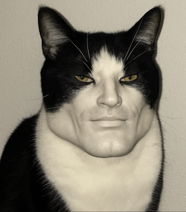
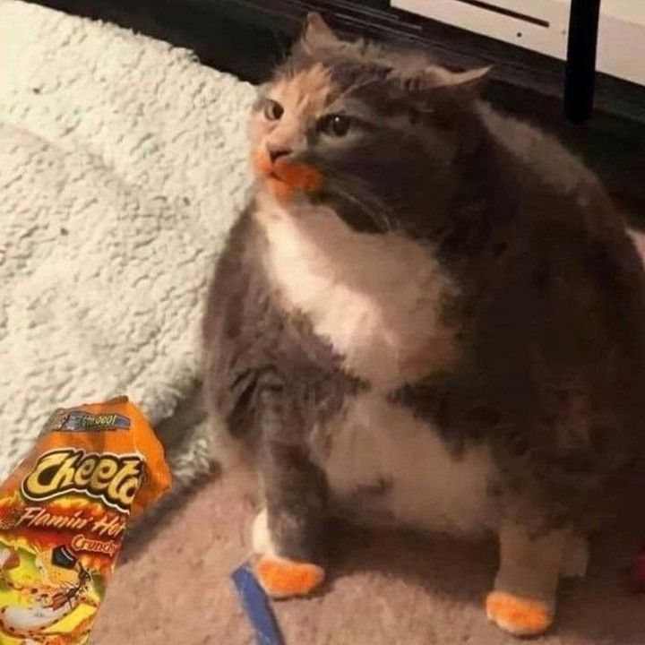

# Machine Learning for the Blind

cover:

excerpt: For those who know the neural network graph thing but don't ACTUALLY know what any of it means
tags: Machine Learning, Beginner
prerequisites:

## Introduction

I never understood machine learning. They show all of these diagrams of neural networks and I always took that at surface value. So I am going to do a deep dive and actually start understanding these things. 

## Wait, it's all floats?

Yup, it's all floats. This diagram you see:


Is a LIE. All the circles are just straight up actual numbers, and the lines are also numbers.

What does this mean? Exactly what it means. 

literally

```txt
float neuron = 0.5;
```

That's what those circles are. The same with the lines. They're literally randomly selected floating point numbers (that changes to be meaningful over time) with a tiny little bit of added complexity.

That's what gets you chat gpt and claude. Crazy stuff.

Anyhow, let's "build" a "project". Let's say we wanna have a model that detects whether or not some image is that of a cat. we have multiple inputs. So instead of making more variables by hand, let's use an array: 

```txt
float inputs[3] = {0.9, 0.3, 0.7}
// very pointy ears, smallish animal, fluff
```

That's it. The comments is what the inputs represent. On a scale from 0.0 to 1.0, how pointy are the ears? Take a look at this: 


Those are very pointy ears. In fact, I would say that they're about 9/10. But since we're talking about 0.0 to 1.0, I'll say 0.9/1.0. I'm assuming it's pretty small (0.3/1.0) and just cuz I drew it and i'm biased, it's 0.7/1.0 fluffy. idk how to draw fluff

Anyhow, now we have 3 inputs. 

I'll explain the difference between inputs and neurons a little further down—don't worry about the difference just yet.

Now let's make some weights. A weight is just a number that indicates how relevant each input is. 

```txt
float weights[3] = {0.8, 0.1, 1.0}

// pointy ears are important (weight[0] = 0.8)
// there are big cats and small cats so this doesn't matter that much (weight[1] = 0.1)
// and fluff is (OBVIOUSLY) very very important (weight[2] = 1.0)
```

Ok. So what exactly did we just make?? Well, *technically* we didn't actually make neurons.

```txt
float inputs[3] = {0.9, 0.3, 0.7}
```

These three aren't *neurons*, they're *inputs*. It's just cuz we put the numbers (0.9, 0.3, 0.7) in there ourselves. It was never *computed* by anything else before that, we just thought the ears were pointy and the cat, fluffy.

In order to *actually* create our first **neuron** we have to do some computations. Remember the weights? 

```txt
float weights[3] = {0.8, 0.1, 1.0}
```

We can use the inputs with the weights and make some calculation that means something: 

If the cat's ears are this (0.9) pointy, and pointiness matters this (0.8) much, doesn't it kinda make sense if we just multiply these two numbers?

And then we can do this for all the inputs and their corresponding weights. The cat is this (0.3) big, and size (of the cat) only matters this (0.1) much. The cat is this (0.7) fluffy, and fluffiness matters this(1.0) much. 

Now we can add all the multiplied values together like this:

```txt
Result = (0.9 * 0.8) + (0.3 * 0.1) + (0.7 * 1.0) = 1.45
```

It doesn't have to be between 0 and 1 btw these are random values I made up and the result happens to be 1.45. But since this is hard to interpret (145% a cat???) we use something called a sigmoid function to squish the value to a percentage point (between 0 and 1). 

This is how the sigmoid works: 

```txt
// Big positive number -> close to 1
// Big negative number -> close to 0
// zero -> 0.5

float sigmoid(float x) {
    return 1.0 / (1.0 + exp(-x));
}
```
but that looks kinda scary so

let me put it into math format:

$$
\sigma(x) = \frac{1}{1+e^{-x}}
$$

(the lil symbol thing is sigma 🗿)

this function, when graphed, looks like this: 


Which means whatever x you input, it'll be between 0 and 1. Higher the x, closer f(x) is to 1. Lower the x into negative, the closer f(x) is to 0. 

Anyway now if we put the number we got (1.45) into the sigmoid function we get:

$$
\sigma(1.45) = \frac{1}{1 + e^{-1.45}}
$$

$$
\sigma(1.45)= \frac{1}{1+2.72^{-1.45}}
$$

$$
\sigma(1.45)= \frac{1}{1.23}
$$

$$
\sigma(1.45)= 0.81
$$

The numbers were rounded but you get the point. Kids' stuff. 

Now our model, based on 

```txt
float inputs[3] = {0.9, 0.3, 0.7}
```
this and 

```txt
float weights[3] = {0.8, 0.1, 1.0}
```
this, thinks that there's an 81% chance that we were in fact describing a cat.

Well, it's not actually a percentage. It's like a 0-1 confidence-ish value. But we're just gonna pretend it's a percentage for the rest of this section to make it more intuitive.

Congratulations! You've just done **forward pass** on a neural "network" model (it's not actually a network since we have like one neuron, but still)

Here's the code you can play with for your very first, bare bones, fully manual neural "network" model: 

```py
import math

inputs = [0.9, 0.3, 0.7]
# pointy ears, size of animal, fluff

weights = [0.8, 0.1, 1.0]
# pointy ears is important, size not so much, fluff very much so

result = 0.0
# init result var

for i in range(len(inputs)):
    result += inputs[i] * weights[i]
    # add (0.9 * 0.8) + (0.3 * 0.1) + (0.7 * 1.0) to results

sigma = (1/(1 + math.e ** (-1 * result)))
# sigmafy results to become percentage

print(sigma)
# print sigmafied result

```

But something is off... Imagine all the inputs are 0. The ears are not pointy at all, it has 0 size(..?) and it isn't fluffy at all. 


(this is our reference image. It's a brick wall. not very "cat")

What would our model think? Let's do the math. 

$$
(0*0.8)+(0*0.1)+(0*1.0)=0
$$

$$
\sigma(0) = \frac{1}{1+e^{-0}}
$$

$$
\sigma(0) = \frac{1}{1+1}
$$

$$
\sigma(0) = \frac{1}{2}=0.5
$$

...huh??

When our inputs were all 0's, our model predicts that it's has a 50% chance of it being a cat. That's not right. If it has fully rounded ears, is infinitely small and is not fluffy at all, how could it possibly be a cat?? This means if I literally described a picture of a brick wall and gave our model the inputs, it would predict that it's 50% cat. 

Well, it can't be **that** bad. Let's give it the **most *cat* cat** we could possibly find: maximum ear-pointiness, maximum size, and maximum fluffiness. Let's do the math. 


(the most cat cat)

$$
(1.0*0.8)+(1.0*0.1)+(1.0*1.0)=1.9
$$

$$
\sigma(1.9) = \frac{1}{1+e^{-1.9}}
$$

$$
\sigma(0) = \frac{1}{1+0.15}
$$

$$
\sigma(0) = \frac{1}{1.15}=0.87
$$

...wait what??? that can't be right. That's the most **cat** looking **cat** if **i've** ever seen one.

The maximum probability of something being a cat, according to our model, is 87%. The minimum is 50%. 

It seems for any set of inputs, the absolute minimum is 50%, and the absolute maximum is 87%. 

That's not good. In short, our model kinda **sucks**. It's super inaccurate. I guess I mentioned we're gonna make a model, but never really specified that it would be any **good**. 

Let's try to duct tape a solution this problem.

Let's first try to account for the worst case brick-wall scenario. 

If all the inputs are 0, we want the result to be (at least close to) 0%. Let's just, from the result of the sum, subtract like 10. So then we get:

$$
(0*0.8)+(0*0.1)+(0*1.0)=0
$$

$$
0 - 10 = -10
$$

$$
\sigma(-10) = \frac{1}{1+e^{-(-10)}}
$$

$$
\sigma(-10) = \frac{1}{1+22026}
$$

$$
\sigma(-10) = \frac{1}{22027}=0.00005
$$

Nice! 0.00005 is basically 0. So now, when all the inputs are 0, our model knows that it's almost 0% a cat!

...But what happens to the other side? What if we get the **most *cat* cat**? Then in this sequence:

$$
(1.0*0.8)+(1.0*0.1)+(1.0*1.0)=1.9
$$

we now subtract 10 like we did before, which becomes

$$
\sigma(1.9 - 10) = \sigma(-8.1)
$$

$$
\sigma(-8.1) = \frac{1}{1+e^{-(-8.1)}}
$$

$$
\sigma(-8.1) = \frac{1}{1+3294}
$$

$$
\sigma(-8.1) = \frac{1}{3295}=0.0003
$$

...whoops. Now the **most *cat* cat** has a 0% chance of being a cat. That doesn't make sense. 

So to prevent this let's add some more duct tape. 

Let's just CRANK UP the weights so that the -10 just doesn't effect the final result. All this time, we've been multiplying 0 and 1 by the weights, which were 0.8, 0.1 and 1.0. Let's just crank all of em to 10 and see what happens. We'll try both the brick wall and the super cat.

$$
(0.0*10)+(0.0*10)+(0.0*10)=0
$$

Well, for the brick wall it doesn't change since it's all 0's. That's a feature. We want that to stay 0 so that the previous math of the brick wall is still 0%. 

Let's try the super cat.

$$
(1.0*10)+(1.0*10)+(1.0*10)=30
$$

and we subtract 10:

$$
30-10=20
$$

let's continue:

$$
\sigma(20) = \frac{1}{1+e^{-20}}
$$

$$
\sigma(20) = \frac{1}{1+0.000000002}
$$

$$
\sigma(20) = \frac{1}{1.000000002}=0.9999...
$$

Nice! Now the super cat is 99.999...% cat, and the brick wall is 0.00005% cat! What we just added is a **bias**. In a normal, many neurons example(this whole cat detector thing is like a single neuron and like 3 input values), every neuron would have their own bias that changes based on it's training. We'll talk about it later. This adds literally two lines to our intial code:

```py
import math

inputs = [0.35, 0.35, 0.35]
# pointy ears, size of animal, fluff

weights = [10, 10, 10]
# pointy ears is important, size not so much, fluff very much so

# >>>>>>>>>>>>>>>>>>>> FIRST LINE ADDED HERE >>>>>>>>>>>>>>>>>>>>
bias = -10
# This is initializing what our bias is.
# >>>>>>>>>>>>>>>>>>>> FIRST LINE ENDS HERE >>>>>>>>>>>>>>>>>>>>>

result = 0.0
# init result var

for i in range(len(inputs)):
    result += inputs[i] * weights[i]
    # add (0.35 * 10) + (0.35 * 10) + (0.35 * 10) to results

# >>>>>>>>>>>>>>>>>>>> SECOND LINE ADDED HERE >>>>>>>>>>>>>>>>>>>>
result += bias
# Add the bias to our resulting value
# >>>>>>>>>>>>>>>>>>>> SECOND LINE ENDS HERE >>>>>>>>>>>>>>>>>>>>>

sigma = (1/(1 + math.e ** (-1 * result)))
# sigmafy results to become percentage

print(sigma)
# print sigmafied result

```


Anyhow, That's perfect. That's exactly what we want!

...right?

Well, we don't actually know, so let's test it a little. We'll do like 0.35 for each input case.

$$
(0.35*10)+(0.35*10)+(0.35*10)=10.5
$$

$$
10.5-10=0.5
$$

$$
\sigma(0.5) = \frac{1}{1+e^{-0.5}}
$$

$$
\sigma(0.5) = \frac{1}{1+0.6}
$$

$$
\sigma(0.5) = \frac{1}{1.6}=0.625
$$

Ok, not bad, not good, idk. 

Well, let's try on a 0.25 case. 0.35 was a weird number. 

$$
(0.25*10)+(0.25*10)+(0.25*10)=7.5
$$

$$
7.5 - 10 = -2.5
$$

$$
\sigma(-2.5) = \frac{1}{1+e^{-(-2.5)}}
$$

$$
\sigma(-2.5) = \frac{1}{1+12.2}
$$

$$
\sigma(-2.5) = \frac{1}{13.2}=0.08
$$

Wait what?? When all the inputs were 0.35, there was a 62.5% chance that this thing was a cat. When we get a thing that's slightly less a cat, 0.25, the probability that it's a cat becomes 8%. That is also a problem. And it's a problem that we can't solve with duct tape anymore. This is the reason it's called machine **learning** - we can no longer keep shifting values until something works. And we can't keep hand-picking inputs and biases randomly either. That leads us to our next section:

## Training Arc

Now, we have to actually **train** the model. Right now all we've been doing is hand-picking some random numbers and doing some math to get some result-we've been learning about **forward pass**. 

But now, we need more neurons, and more ways to properly **calibrate** these numbers into something meaningful so that we can make them as accurate as possible. 

But how do we actually train the model? How do we know how to tweak what values to what, by how much, and why? To know this we first have to understand the idea of a **label**, and also **loss**. These are very simple ideas. 

**label** is the correct answer. 


this is **100%** a cat, and thus the label should be 1.0 in our example. And IF our **current** model were to predict that this is 42% likely to be a cat, it would be 58% **wrong**. That is our **loss**. The lower the loss the better-since 0% **wrong** would be 100% **right**.

In short, our label is the objective answer to a question, and the loss is how wrong our model was in its guess. 

```
label = 1.0
model_prediction = 0.42
loss = label - model_prediction

print(loss)
# 0.58
```

Yes, I know this cat example is getting boring... but hang on for a second-in my research I found a perfect excuse to move on to a different joke, but only after this one small idea you gotta understand.



Take this picture. We'll label it like 80% cat (the other 20% is cheetos)

```
label = 0.80
```

And then let's compute it using our model we made before. This will be the cranked up version.

```
inputs = [0.2, 1.0, 0.5]
# it's ears are like 20% pointy, it's 100% big, and it's 50% fluffy.

weights = [10, 10, 10]
# the cranked up weights
```

Ok. Now let's run it. 

$$
(0.2*10)+(1.0*10)+(0.5*10)=17
$$

$$
17-10=7
$$

$$
\sigma(7) = \frac{1}{1+e^{-7}}
$$

$$
\sigma(7) = \frac{1}{1+0.0009}
$$

$$
\sigma(7) = \frac{1}{1.0009}=0.9991
$$

Well, I guess it did a pretty decent job. But we wanted 80%, not 99.91%! It forgot to account for the 20% cheetos.

Let's check the **loss**. 

$$
loss = 0.80 - 0.9991
$$

$$
loss = -0.1991
$$

Wait a minute. The loss is **negative**. Then since the loss is -19.91%, are we 119.91% correct?? 

(no)

we need a way to interpret this negative number. Your immediate instinct might be to just take the absolute value of this number and move on. Which is a great instinct! That was my instinct, actually, which is why I said it was great. 

But apparently not. 

This is something I'll teach you in more detail a little later, but what you need to know is that we tend to **square** the loss, not only to get rid of the negative but to **emphasize** the bigger issues. 

For example, if our loss is 0.9, and we square it, it becomes **0.81**. If our loss is 0.1, and we square it, it becomes **0.01**. 

See the difference? The bigger losses get shrunk down **less**, and we can tend to the bigger issues which are a lot more "visible" compared to the others. 

You don't really need to understand how everything works right now-just understand the vibe of what's going on. Since bigger numbers stay bigger, they're emphasized as bigger problems. Since smaller problems become even smaller, we can ignore them for now and tend to the bigger ones. ("problems" in this context is just referencing **loss**). 

So let's square it.

$$
loss = (-0.1991)^2
$$

$$
loss = 0.04
$$

Not the biggest problem it seems, but it's the only one we have right now, so let's try fix it. How? 

First, let's try the duct tape method. 

Let's have a "nudge" value: 

```
nudge = 0.1
```

And then let's just either add or subtract it from our weights! 

Let's do the second one, since that one has the highest input. 

```
weights = [10, 10.1, 10]
```

$$
(0.2*10)+(1.0*10.1)+(0.5*10)=17.1
$$

$$
17.02-10=7.1
$$

$$
\sigma(7.1) = \frac{1}{1+e^{-7.1}}
$$

$$
\sigma(7.1) = \frac{1}{1+0.0008}
$$

$$
\sigma(7.1) = \frac{1}{1.0008}=0.9992
$$

Whoops! We accidently seem to have made loss a TINY bit **bigger**. 

This was the previous number for comparison: 

$$
0.9991
$$

And this is the new number:

$$
0.9992
$$

What we wanted was 0.80. 

Our loss went **up** by a fraction of a decimal. 

So instead of nudging it up into 10.1, let's nudge it downwards, to get 9.9. 

$$
(0.2*10)+(1.0*9.9)+(0.5*10)=16.9
$$

$$
16.9-10=6.9
$$

$$
\sigma(6.9) = \frac{1}{1+e^{-6.9}}
$$

$$
\sigma(6.9) = \frac{1}{1+0.001}
$$

$$
\sigma(6.9) = \frac{1}{1.001}=0.9990
$$

WOW! YOU SEE THAT?!

Our loss went **down**. By a fraction of a decimal. 

Here's the previous number for comparison. 

$$
0.9991
$$

Here's the new number: 

$$
0.9990
$$

We wanted 0.80. So our loss went down. 

Bro I am ***NOT*** doing allat for every weight and like increasing and decreasing the nudge value and shi 💀🥀🪦💔

In fact, it's slow for *us*, and it's even slow for ***computers***. Computers are working on literally hundreds of **billions** to **trillions** of weights and biases. They are **NOT** going to sit there manually testing and calculating the numbers for every individual neuron, like we did above. 

Because imagine we have a neuron where the input is the output of another neuron. We would literally have to **re-calculate** every single neuron's value and see the final result and see if our loss went down. Even with computers, that's impossible at the scale humanity has achieved thus far. 

So what do we do to make this drastically faster? Well, we use all mighty **calculus**. 


Yeah ik I hate calculus too. But it's necessary. When you asked the school teacher when you'd ever use this stuff, this is an example of when. 

## Gradients

Since I hate calculus, let's not even talk about it for now. Let's talk about some other problems so we can productively procrastinate on calculus. 

Let's forget the calculations we did above and focus only on the results for a second. Our loss went down by 0.0001. Now, just based on this number, forgetting about the fact that we manually tested this with values we know, can you tell me if that difference is actually a **lot** or a **little**? So can you tell me like if that's a big change to our loss or a small change to our loss? 

It's like this: if I say I pushed my car and it moved 3 feet, I have no way to tell how **strong** you are. If you full body slammed the car and it moved 3 feet, you're probably normal. If you flicked it with your pinky and it moved 3 feet, you might be the hulk. 

In that same way, if you just give me the change in loss: 0.0001, I have no way of knowing the nudge value that was used for that value, and thus how effective our change actually was. 

If our nudge value was like 3000 and our change in loss was 0.0001, that weight would be a super numb one and changing the it doesn't impact the loss very much. 

If our nudge was like 0.00000000000000001 and our change in loss was 0.0001, that would be a SUPER sensitive weight and changing it, even slightly, would impact the loss drastically. 

Well, let's revisit the original problem that we had with this new small piece of knowledge. How do we find the optimal change to our weight? We want to reduce loss as much as possible.

Well, your first instinct may be to graph it. It wasn't my first instinct so don't be surprised, but if it was i mean ur smarter than me already. 

