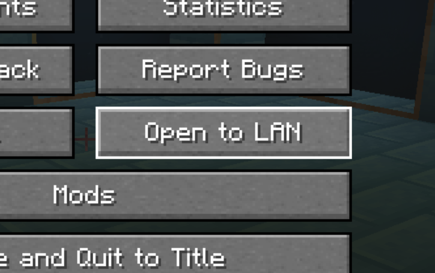
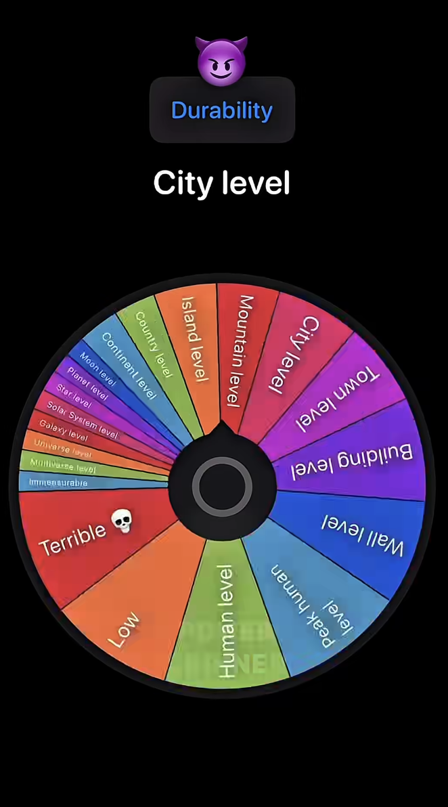

# Network Programming, but not f*cking boring

cover:
excerpt:
tags:
prerequisites:

## Who cares
Network programming is pretty cool imo. this is actually getting pretty valuable nowadays i think cuz even with ai and stuff you still have to send stuff from one computer to another like from servers to your computer. This has js been my op for so long cuz i didn't know any network programming and that bit me in the ahh

## What even is a network

Ok so lets talk about networks first, and then power levels.
basically a network is multiple computers that are capable of talking to each other. connections are either with wires and cables and shi or wireless with radio signals that mess with your nervous system

Ok so now power levels. So obviously you prolly heard of "LAN"

if you're a seasoned veteran you'll recognize ts:

shi brings a tear to my eyes i can't handle this nostalgia 😢

Anyhow LAN stands for "Local Area Network". 

Ok so you know that one meme where some guy on a short is spinning like a wheel to determine some guy's power level like he got some guy in the comments like "i can solo jjk verse" or sum like ts:

😭 Anyhow LAN is like the "building level". it's just referring to the fact that the computers are all wired up in the same building or the same house or something. So like we used to open to lan in the minecraft screenshot cuz we just wanna connect to the bros that r in ur house playing wit u and not to random strangers. so like if you try to open a server that's available to a bro thats across the country you probably noticed how it's kinda different

I lied actually. When you connect to minecraft LAN to play with the in house hb's you're probably actually using "WLAN", which stands for "Wireless Local Area Network" cuz you're probably not literally connecting your computers with wires it's prolly js using radio waves

but yeah that's what LAN is. The reason you gotta know that is cuz there's like a bunch of other ones like look at this bullcrap

PAN - Personal Area Network (Human level in the wheel). Like bluetooth to ur airpods an shi

LAN - we covered ts

WLAN - we covered ts

MAN - Metropolitan Area Network (City level). like imagine they give out free public wifi to like a whole city instead of just starbucks or mcdonalds or sum shi that's what this would be idk i couldn't think of a better example

WAN - Wide Area Network (gojo level). the range is effectively infinite. an example is literally the entire internet

Honerable mentions
CAN - Campus Area Network (Town level or sum) the range is just like uni wifi or something

You see the pattern? Lowk this shi not that important just slap any letter in front of Area Network and you get like a visual into how big of a network you're talkin about like I could say like some absolute random bullcrap like IAN Island Area Network and the only reason people will notice is cuz they'll think i'm releasing the files

Oh yeah btw irl as the area gets larger it gets slower and more expensive with the sole exception of satoru gojo of course

---
## Client  server models and other models

Aight so now let's talk about the client-server model and the p2p model

You probably already know what the client server model is basically all the heavy stuff runs on like the NVIDIA 9000000 GPUs somewhere else while your computer just connects to it to feeds on that shi like a parasite

basically the user's computer that does less heavy processing and shi is the client and what it's connecting to to get info is the server that does more heavy stuff

oh yeah something interesting like chat gpt isn't running on ur computer cuz if it did ur computer would explode so like ur basically just sending ur prompts to chat gpt servers and then they run the model for you, adn then they give u the result for it. Anyhow that basically means all ur doing is sending all ur prompts to chat gpt servers 😳 they know who you are

Bro 😭 I remember one dude in high school we looked at this guy's chat gpt history and one of the things were like "how to focus on becoming sigma and ignore pretty girls" or sum shi we was dying 😭😭😭 generational aura debt

anyway yeah like all the games nowadays are kinda that unless it's single player most of the syncing between u and other players is done on better computers somewhere else

Ok lets talk about p2p this does not stand for pay to play it stands for "peer to peer". This is lowk interesting but let's actually first talk about the "listen server model" cuz it's more intuitive

You know how it lethal company or amogus you create a game and then people join? Like you prolly seen like hosting a game or something like you create the game and then ur in there by urself u give gng a code or something they put it in and they join ur game. That's the listen-server model, where basically YOU ARE the server like you become the server and then ur computer actually does all the hard stuff of like syncing and allat that's just a listen server model

ok so back to the p2p model imagine like instead of ur computer becoming the server, EVERYONE's computer is both the server AND the client so like you're sharing resources which means one guy's computer doesn't have to explode cuz we can contain the explosion to like many different computers and everyone can have a good time

like imagine minecraft but like your computer is the server for like 100 chunks only and then ur bros computer is the server for a different 100 chunks and so on so like then ur computer only has to do heavy work for 100 chunks instead of a bajillion and it only does heavier work if someone steps in ur territory

that actually has a name its called distributed virtual worlds or like distributed game hosting there's lowk a bunch of problems tho like what happens if i'm standing like on the edge like between ur chunk and ur friends chunk who does the processing and like what happens and also like if u log off and no one does the processing for ur territory and no one can grief ur base which ig is pretty decent but like what if u get like a wife or sum and she js tryna take a look at ur house but ur offline unless someone saved ur chunks or something it's gonna be hard

that's what p2p model is

we'll learn the details of ts later just understand the idea behind it

---

## Circuit switching vs packet switching

