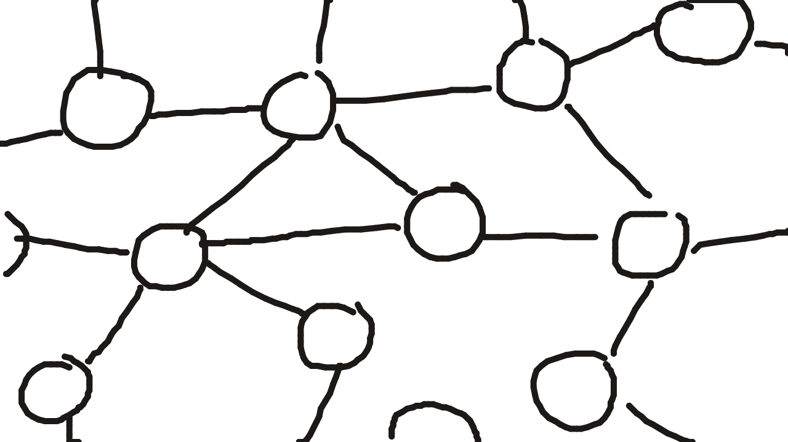
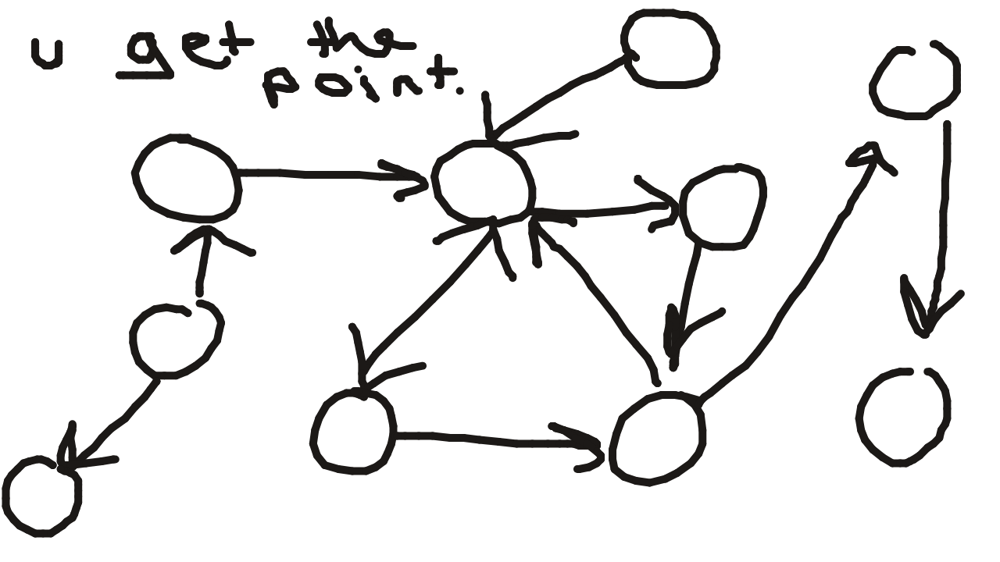
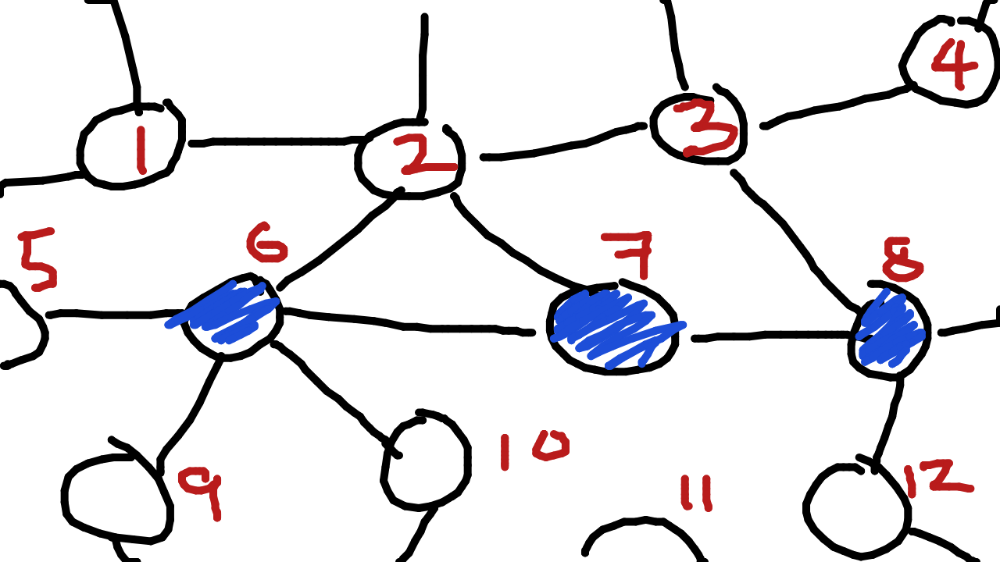
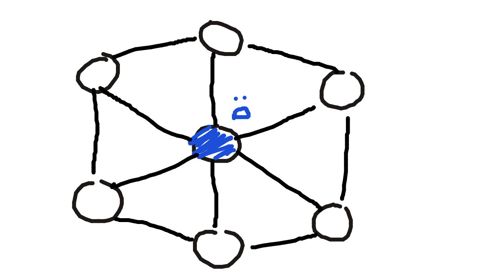
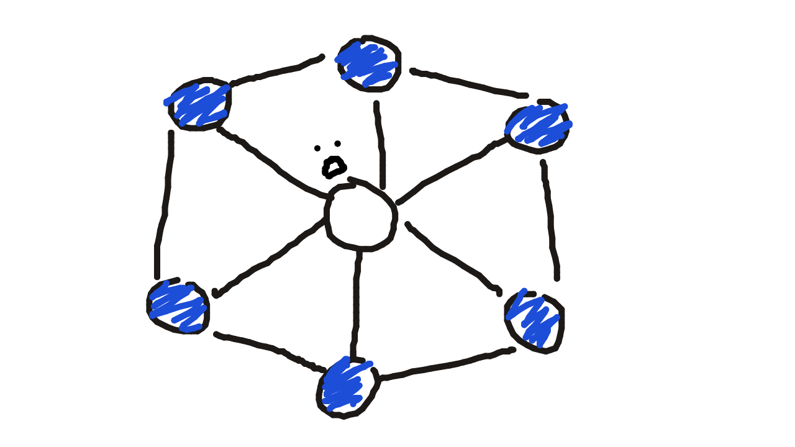
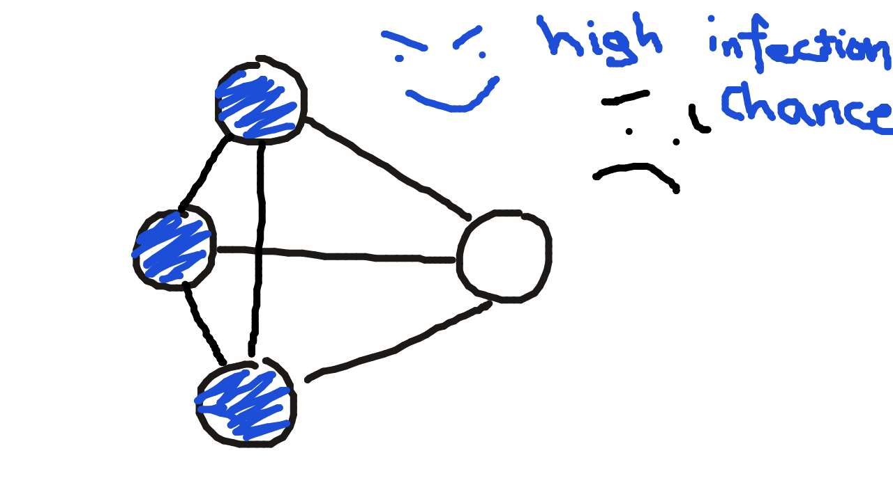
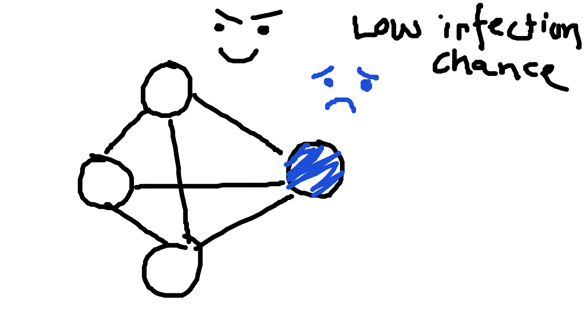

# Understanding Papers: Randomized Zero Forcing

cover: 
excerpt: Understanding the paper "Randomized Zero Forcing", by Jesse Geneson, Illya Hicks, Noah Lichtenberg, Alvin Moon, and Nicolas Robles.
tags: Understanding Papers, Discrete Mathematics
prerequisites:

## Introduction

Welcome to the understanding papers series. This is an article about [Randomized Zero Forcing](https://arxiv.org/pdf/2602.16300), a paper by Jesse Geneson, Illya Hicks, Noah Lichtenberg, Alvin Moon, and Nicolas Robles. It's never as hard as you think!

## Understanding Graphs

We're not actually talking about the algebra graphs this time. No coordinates or x or y axis. This time, we're talking about this kind of graphs: 

Looks big and complicated, but a graph is just dots and lines. That's it. You don't need a bigger understanding of graphs for this paper. 

What's nice to know though, is a **directed graph**. Same thing as above, but imagine the lines are arrows instead. 

This describes friendships for example-person A might think person B is a friend, but person B might think otherwise. In that scenario, A would point to B, but B wouldn't point to A. If they're both homies tho they'd have bidirectional arrows and point to each other. 

## Zero Forcing (ZF)

Now, let's get to the rudimentary part of the paper. Zero Forcing. 

You know Conway's Game of Life? Imagine that, but much simpler. 

Imagine you pick some dots in a graph to be blue, and the other ones, white. 

Now, the blue dots can INFECT white dots to become blue, but only if a blue dot has ONLY ONE white dot as a neighbor. 

The official rule is: 

> If a blue dot has exactly one white neighbor, that white neighbor turns blue.

In this situation, in one **round** (applying the rule one time), 2 would become blue because 7's only white neighbor is 2. Nothing else would become blue, because 6 has 4 white neighbors (including 2) and 8 has 2 white neighbors. Since 7 only has 1 white neighbor, that white neighbor becomes blue. 

Like a zombie apocalypse where the zombies gang up on humans only if they have only one human to focus on. Otherwise they get distracted and don't bite anyone. A zombie who chases more than 1 human catches none. 

But notice something interesting. What if you have a situation like this? 

This is not mahoraga's crown but 6 white dots surrounding a single blue dot. 

In this situation, no new blue dots can be made. In this situation, you get some kind of stalemate, where no matter how many times you apply this rule, nothing happens. 

In another situation, for example, this: 

In this situation, it only takes one application of this rule for all dots in this graph to become blue. 

So there are only two possibilities when you apply this rule over and over again: 

it either:
- Everything turns blue, or
- You get stuck, and no more blue dots can be made.

The goal is to make everything blue. 

The question is: 

> What's the smallest starting blue set that will eventually turn the whole graph blue?

## Probabilistic Zero Forcing (PZF)

Now this one is even more like a zombie apocalypse. 

Imagine the same game (Zero Forcing), but instead of this rule of a blue dot only needing one white dot neighbor, you implement a **probability** system, where there's a chance of any white dot becoming blue.

But here's the catch. For every blue dot around a blue dot, that blue dot's chance of infecting white dots around it increases. 

Notice how in both pictures, the blue dots and white dots still have to be connected with each other? Just a quick reminder, cuz it's important that even if there's more zombies or more humans, if they don't coordinate together well, the chance of infecting / not being infected becomes lower. 

This is an important little nitpick here: 

The **CHANCE** for each individual white dot to become infected is the same. The dice roll is different for each individual white. 

If the chance of infection is 50%, and the blue dot wins that gamble, only one white dot is becoming blue, and then that blue dot has to win the gamble with the next white dot, then the next, etc. It's not an airborn super zombie that turns 5 white dots into blue instantly because he won **one** gamble. Make sense? 

But here's the actual math equation to calculate the chance of infection: 

> \# of blue neighbors including itself ÷ total \# of neighbors of the blue dot, including itself.

So basically: 

> \# of zombies around a zombie including itself ÷ total \# of zombified or non zombified humans around that zombie, including itself.

## The actual paper (RZF)

Now let's actually talk about Randomized Zero Forcing (RZF). Forget about the zombie analogy completely, because it doesn't really make sense here. Let's take PZF, and then change two things: 

1. The graph is now directed. The lines between the dots are now arrows.
2. In PZF, the blue dots try to INFECT white dots. That blue dot is the **actor**. In RZF, *white dots* decide whether to turn *themselves* blue or not, based on the incoming arrows. 

Here's the official rule: 

> A white dot turns blue with probability equal to the fraction of its in-neighbors that are blue.

So the actual math behind that is:

> \# of blue in-neighbors ÷ total \# of all in-neighbors

